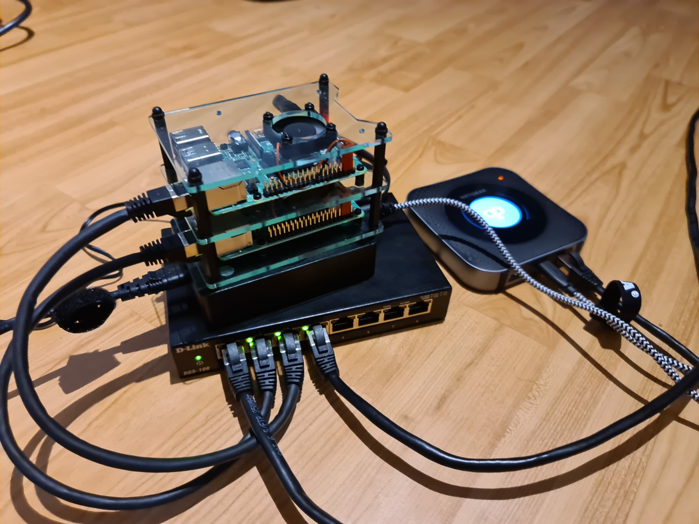

# Chat App

Node.js chat app running intended to run on a raspberry pi kubernetes cluster.

### Final build 

- 2 Node kubernetes cluster running on raspberry pi 4 4G Model B
- The raspberry's are connected to a 8 port switch
- Power supply through a 6 port usb station
- Mobile router with a sim card for WAN
